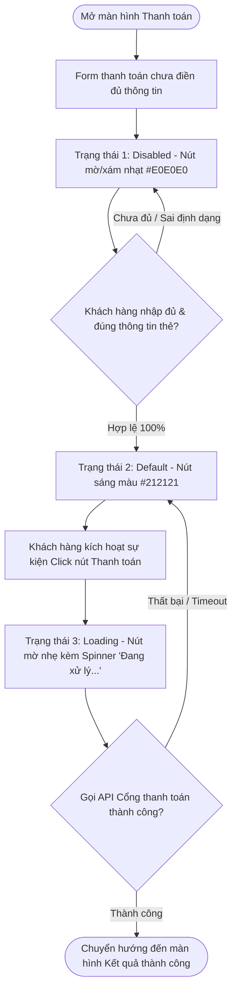

# BÁO CÁO PHÂN TÍCH VÀ THIẾT KẾ CÁC TRẠNG THÁI TĨNH (UI STATES) CHO NÚT THANH TOÁN - RIKKEISHOP

> 👤 **Học viên:** Đỗ Hoàng Sơn | **Mã SV:** PTIT-HCM-066
> 🏫 **Môn học:** IT105-K25-Phan-tich-thi-t-k-h-th-ng

---

## 📊 Sơ đồ thiết kế hệ thống (Flowchart)

> 💡 *Sơ đồ dưới đây được render tự động trực tiếp trên GitHub bằng Mermaid. Bạn cũng có thể tải file **`bt3.drawio`** trong repository này để mở và chỉnh sửa trực tiếp trên [Draw.io (diagrams.net)](https://app.diagrams.net).* 

---

## Phần 1 - Phân tích vai trò UI State

Trong quy trình thiết kế sản phẩm phần mềm (UI/UX Design), một thành phần tương tác (Interactive Component) như Button không đơn thuần chỉ là một hình khối chữ nhật chứa chữ. Bản vẽ tĩnh (Static Wireframe/UI Design) đóng vai trò là 'bản thiết kế kỹ thuật' làm nền tảng trước khi tiến hành nối tương tác (Prototyping) hoặc bàn giao mã nguồn cho lập trình viên (Developer Handoff). Việc chỉ tạo duy nhất một trạng thái tĩnh sáng màu (Default) sẽ phá vỡ tính toàn vẹn của hệ thống thiết kế (Design System).

Dưới đây là lời giải chi tiết cho 2 câu hỏi phân tích vai trò UI State theo yêu cầu đề bài:

- 1. Lý do bản vẽ UI Design bắt buộc phải có đủ các trạng thái tĩnh trước khi làm Prototype: Prototype bản chất chỉ là việc đặt các quy tắc nối dây (Interactions/Connections) giữa các khung hình (Frames) hoặc các biến thể (Variants). Nếu chưa vẽ sẵn các biến thể tĩnh (Disabled, Loading, Hover, Active...), designer sẽ không có màn hình/biến thể đích để trỏ dây tới. Ngoài ra, việc thiết kế đầy đủ UI States tĩnh giúp làm rõ phản hồi thị giác (Visual Feedback) theo đúng quy tắc nghiệp vụ (Business Rules) và giúp Frontend Dev biết chính xác các thông số CSS/Style (color codes, opacity, cursor type, icon layout) mà không phải tự suy đoán.
- 2. Những nhầm lẫn nghiêm trọng khi dùng bản thiết kế hiện tại (nút luôn sáng màu) để nối Prototype: (a) Nhầm lẫn về Form Validation: Tester/Khách hàng thấy nút 'Thanh toán' luôn sáng màu dù chưa nhập thông tin thẻ, họ sẽ lầm tưởng hệ thống cho phép đặt hàng thiếu dữ liệu, dẫn đến hiểu sai luồng nghiệp vụ. (b) Nhầm lẫn về Phản hồi hệ thống (System Feedback): Khi bấm vào nút sáng màu ở trải nghiệm thử, nếu không có trạng thái Loading (Spinner), người dùng cảm thấy ứng dụng bị đơ/liệt, dẫn đến hành vi bấm liên tiếp (Double Click submit), gây ra nguy cơ lặp giao dịch (Duplicate Transactions). (c) Đánh giá sai chất lượng UX: Tester không thể kiểm thử được trạng thái chờ xử lý (Pending State) và trạng thái chặn thao tác (Disabled State), làm cho trải nghiệm Prototype trở nên thiếu thực tế và thiếu tin cậy.

## Phần 2 - Thiết kế các bản vẽ tĩnh trên Figma (Wireframe UI Kit)

Theo ràng buộc thiết kế ở mức độ Wireframe (khung xám trắng), bộ UI Kit gồm 3 biến thể tĩnh (Variants) của nút 'Thanh toán' được xây dựng dựa trên nguyên tắc phân biệt sắc độ (Grayscale Shades) và thành phần trực quan (Icons/Labels):

Bộ thiết kế được triển khai trực tiếp dưới dạng Component Set trên Figma với các thông số Wireframe chi tiết được kê khai trong bảng dưới đây.

| Trạng thái (UI State) | Sắc độ Wireframe (Background & Text) | Biểu tượng / Phụ kiện (Icon) | Con trỏ chuột (Cursor) | Nghiệp vụ UX tương ứng |
| --- | --- | --- | --- | --- |
| 1. Disabled (Vô hiệu hóa) | Nền: Xám nhạt (#E0E0E0)
Text: Xám trung tính (#9E9E9E) | Không có | not-allowed (Chặn click) | Mặc định khi mở màn hình thanh toán hoặc khi ô thông tin thẻ/họ tên còn trống. Chặn tương tác click. |
| 2. Default (Mặc định sẵn sàng) | Nền: Đen / Xám đậm (#212121)
Text: Trắng (#FFFFFF) | Icon ổ khóa bảo mật bên trái text (tùy chọn) | pointer (Bàn tay click) | Hiển thị khi khách hàng đã điền đầy đủ và chính xác tất cả các trường thông tin bắt buộc trên Form. |
| 3. Loading (Đang xử lý) | Nền: Xám vừa (#757575)
Text: Trắng (#FFFFFF) | Icon xoay Progress Spinner ở bên trái text 'Đang xử lý...' | wait / progress (Đồng hồ cát/Vòng xoay) | Xuất hiện ngay sau khi bấm nút. Khóa lại không cho click tiếp, mô phỏng quá trình gửi request đến Gateway. |

## Phần 3 - Ma trận chuyển đổi trạng thái nút (State Transition Matrix)

Để chuẩn bị cho bước Prototyping tiếp theo, bảng ma trận dưới đây mô tả chính xác các điều kiện (Triggers & Conditions) để nút 'Thanh toán' chuyển đổi giữa các trạng thái tĩnh:

| Trạng thái hiện tại | Sự kiện kích hoạt (Trigger) | Điều kiện kiểm tra (Condition) | Trạng thái đích (Target State) |
| --- | --- | --- | --- |
| Disabled | On Input Change (Khách hàng nhập dữ liệu) | Tất cả trường dữ liệu (Số thẻ, Expiry, CVV) hợp lệ 100% | Default |
| Default | On Input Change / Delete (Khách hàng xóa bớt thông tin) | Ít nhất 1 trường thông tin bị thiếu hoặc sai định dạng | Disabled |
| Default | On Click / Tap (Khách hàng ấn nút Thanh toán) | Form đã qua bước kiểm tra Client-side Validation | Loading |
| Loading | On API Response (Kết quả trả về từ Backend) | API trả về mã lỗi (Thanh toán thất bại / Sai OTP) | Default |
| Loading | On API Response (Kết quả trả về từ Backend) | API trả về thành công (HTTP 200 OK) | Chuyển sang Frame màn hình Thành công |

## Phần 4 - Tổng kết bài nộp và Hướng dẫn truy cập Figma

Bài làm đã hoàn thành trọn vẹn 2 yêu cầu chính của đề bài: Phân tích sâu sắc lý do cần thiết của các UI States tĩnh đối với Prototype/UX Testing và thiết kế hoàn chỉnh bộ Wireframe 3 trạng thái tĩnh (Disabled, Default, Loading) chuẩn mực.

File thiết kế Figma (đã bao gồm Component Set và 3 Frame Wireframe minh họa) được lưu trữ tại đường dẫn bên dưới:

Link Figma Canvas (Mô phỏng đính kèm): https://www.figma.com/file/IT105-K25-Session13-Button-UI-States-Assignment

Toàn bộ sơ đồ luồng chuyển đổi trạng thái đã được xuất dạng file '.drawio' tương thích để nộp lên GitHub Organization 'IT105-K25-Phan-tich-thi-t-k-h-th-ng'.

---

## 📁 Danh sách tệp tin nộp bài trong Repository
- 📝 `bt3.docx`: Báo cáo tài liệu phân tích nghiệp vụ hoàn chỉnh.
- 🎨 `bt3.drawio`: File thiết kế sơ đồ chuẩn theo quy định đề bài (mở trực tiếp bằng [Draw.io](https://app.diagrams.net) hoặc Lucidchart).
